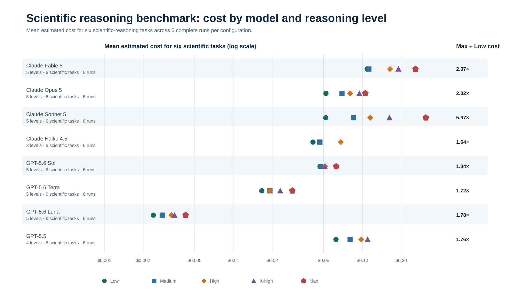

# Token Models Reasoning Demo

This project compares reasoning-token usage, latency, and estimated on-demand cost across Anthropic Claude and OpenAI GPT models on Amazon Bedrock Mantle. The business-operations benchmark scripts use the same six scenarios from `operations_reasoning_benchmark_prompts.json`.

Each request is billable. Review the model lists and pricing dictionaries in the scripts before running a full benchmark.



## Prerequisites

- Python 3.10 or later
- AWS CLI configured with credentials that can invoke the selected Bedrock models in `us-east-1`
- Access to the required Amazon Bedrock marketplace products and model IDs

## Local Setup

Run these commands from this directory 1x:

```bash
python -m pip install virtualenv -Uq --break-system-packages
python -m venv .venv
source .venv/bin/activate
python -m pip install --upgrade pip
python -m pip install -r requirements.txt
```

For future sessions, just use the single command:

```bash
source .venv/bin/activate
```

## AWS Authentication

The scripts use the default AWS credential chain. For AWS IAM Identity Center (SSO), authenticate before starting a benchmark:

```bash
aws sso login
```

To use a named profile, select it in the same shell:

```bash
export AWS_PROFILE=your-profile-name
aws sso login --profile "$AWS_PROFILE"
```

## Fable 5 Account Setup

The Anthropic benchmark includes Claude Fable 5 by default. Before running it, set the AWS account's Amazon Bedrock data-retention mode to `provider_data_share`. Without this account-level data-sharing setting, Fable 5 requests fail.

AWS does not provide a console UI for this setting at launch. With a current AWS CLI, inspect the setting first:

```bash
aws bedrock get-account-data-retention --region us-east-1
```

To opt in to the mode required by Fable 5:

```bash
aws bedrock put-account-data-retention \
  --mode provider_data_share \
  --region us-east-1
```

## Sync With EC2 And S3

For the benchmark, I ran all test on an Amazon EC2 instance in the `us-east-1` AWS Region. This avoided connectivity and other potential issues that could arise from running the scripts locally on my Mac.

Connect to the EC2 instance:

```bash
export YOUR_EC2_IP_ADDRESS=<YOUR_EC2_IP_ADDRESS>

ssh -i ~/.ssh/advanced-networking-cert.pem "ec2-user@${YOUR_EC2_IP_ADDRESS}"
```

From the local Mac, sync the project code to the EC2 instance:

```bash
rsync -avz \
  --exclude '.venv/' \
  --exclude '__pycache__/' \
  --exclude '.git/' \
  --exclude '.DS_Store' \
  --exclude '.gitignore' \
  --exclude 'results/' \
  --exclude 'blog/' \
  --exclude '*.log' \
  -e "ssh -i ~/.ssh/advanced-networking-cert.pem" \
  . \
  "ec2-user@${YOUR_EC2_IP_ADDRESS}:~/token_models_reasoning_demo/"
```

On EC2, upload the completed result files to S3:

```bash
export YOUR_S3_BUCKET=<YOUR_S3_BUCKET>
cd ~/token_models_reasoning_demo
aws s3 sync results/ s3://$YOUR_S3_BUCKET/token_models_reasoning_demo/results/
```

On the local Mac, download those result files from S3:

```bash
cd /Users/garystaf/Documents/Projects/token_models_reasoning_demo
aws s3 sync s3://$YOUR_S3_BUCKET/token_models_reasoning_demo/results/ results/
```

`aws s3 sync` copies new and changed files without deleting files that exist only at the destination.

## Run The Benchmark

Optional: use `time` to measure total runtime of scripts.

```bash
time python operations_bedrock_reasoning_benchmark_anthropic.py
time python operations_bedrock_reasoning_benchmark_openai.py
```

Run the scripts from this project directory so their result files are written here.

Each benchmark case gets a fresh Bedrock bearer token from the active AWS credentials. Transient AWS credential errors are retried six times with exponential backoff.

The timestamped JSON result file is atomically updated after every completed call. If a process is interrupted, the file preserves all calls completed up to that point. A checkpoint is partial evidence and does not automatically resume the remaining combinations.

### Run In The Background

Use `nohup` to run both benchmarks sequentially in one background process that continues after the terminal closes. Change the max value below to run the complete cycles n times, with Anthropic followed by OpenAI in each cycle:

```bash
nohup sh -c '
for run in {1..3}; do
  echo "Starting benchmark cycle $run of 3"
  python -u operations_bedrock_reasoning_benchmark_anthropic.py
  python -u operations_bedrock_reasoning_benchmark_openai.py
done
' > benchmark.log 2>&1 &

BENCHMARK_PID=$!
echo "$BENCHMARK_PID" > benchmark.pid
echo "Benchmark PID: $BENCHMARK_PID"
```

Follow the three-cycle run with:

```bash
tail -f benchmark.log
```

Running sequentially avoids introducing additional Bedrock throttling and local network contention into latency and retry measurements.

Follow the live output:

```bash
tail -f benchmark-run.log
```

Press `Ctrl-C` to stop following the log. This does not stop the benchmark.

Inspect the process using the PID printed when it started:

```bash
ps -p "$BENCHMARK_PID" -o pid,etime,state,command
```

After opening a new terminal, where `BENCHMARK_PID` is no longer defined, find either running benchmark by script name:

```bash
pgrep -fl 'operations_bedrock_reasoning_benchmark_(anthropic|openai)\.py'
```

No matching process means both scripts have finished or the run stopped. Check the end of the log for completion or errors:

```bash
tail -n 50 benchmark-run.log
```

The Mac must remain awake and connected to the network while the benchmarks run.

## Troubleshooting

### Stop A Background Benchmark Loop

If `BENCHMARK_PID` is still defined in the shell that started the loop, request
a graceful stop:

```bash
kill -TERM "$BENCHMARK_PID"
```

If the loop has an active child benchmark, stop the child and the loop:

```bash
pkill -TERM -P "$BENCHMARK_PID"
kill -TERM "$BENCHMARK_PID"
```

In a new terminal, find the running benchmark PID before stopping it:

```bash
pgrep -fl 'bedrock_.*reasoning_benchmark.*\.py'
kill -TERM <PID>
```

Verify that no benchmark scripts remain:

```bash
pgrep -fl 'bedrock_.*reasoning_benchmark.*\.py'
```

No output means the scripts have stopped. If a process ignores the graceful
signal, use `kill -KILL <PID>` only as a final fallback. A stopped run retains
the timestamped JSON checkpoint containing calls completed before termination.

## Logging

Every `json_contract_v5` execution creates a new UTC-stamped file in `results/`, so no run overwrites another:

- `results/operations_bedrock_reasoning_benchmark_anthropic_json_contract_v5_YYYYMMDDTHHMMSSffffffZ.json`
- `results/operations_bedrock_reasoning_benchmark_openai_json_contract_v5_YYYYMMDDTHHMMSSffffffZ.json`

Each record also contains `run_id`, `run_started_at_utc`, `benchmark_variant`, and SHA-256 hashes of the prompt suite, answer key, and system prompt. The chart generator rejects files with different benchmark variants or artifact hashes, incomplete run matrices, duplicate combinations, or unequal provider repetition counts. When Haiku repair files are present, it requires one complete 18-call Haiku matrix per full Anthropic run and replaces the original Haiku records before analysis. By default, it combines every full result and repair file from the newest benchmark variant:

```bash
python blog/generate_blog_charts.py
```

To select result files explicitly:

```bash
python blog/generate_blog_charts.py \
  --anthropic results/operations_bedrock_reasoning_benchmark_anthropic_json_contract_v5_*.json \
  --anthropic-repair results/operations_bedrock_reasoning_repair_anthropic_json_contract_v5_*.json \
  --openai results/operations_bedrock_reasoning_benchmark_openai_json_contract_v5_*.json
```

## Models And Reasoning Levels

The Anthropic benchmark runs:

| Model            | Reasoning levels              |
| ---------------- | ----------------------------- |
| Claude Opus 5    | low, medium, high, xhigh, max |
| Claude Sonnet 5  | low, medium, high, xhigh, max |
| Claude Fable 5   | low, medium, high, xhigh, max |
| Claude Haiku 4.5 | low, medium, high             |

Opus, Sonnet, and Fable use adaptive thinking. Haiku uses extended thinking with explicit budgets.

The OpenAI benchmark runs:

| Model         | Reasoning levels              |
| ------------- | ----------------------------- |
| GPT-5.6 Sol   | low, medium, high, xhigh, max |
| GPT-5.6 Terra | low, medium, high, xhigh, max |
| GPT-5.6 Luna  | low, medium, high, xhigh, max |
| GPT-5.5       | low, medium, high, xhigh      |

The benchmarks intentionally start at `low`; they do not include a no-reasoning baseline.

## Prompt Suite

`operations_reasoning_benchmark_prompts.json` contains six shared prompts:

- `pipeline_simple`
- `pipeline_moderate`
- `pipeline_complex`
- `policy`
- `extraction`
- `debugging`

Keep this file unchanged between provider runs when comparing results.

## Scientific Replication Suite

The repository also includes a second, independently verified task set in the
scientific field-research domain. It tests whether conclusions from the
business-operations suite generalize rather than reflect one unusual prompt
set. The six scenarios cover chemistry, genetics, stratified ecology,
astronomy event analysis, laboratory resource allocation, and research-vessel
scheduling, with two tasks at each difficulty level.

Verify its answer key without making model requests:

```bash
python3 scientific_verify_answer_key.py
```

Run the complete scientific suite with the same provider model matrices and
reasoning levels as the original benchmark:

```bash
python3 -u scientific_bedrock_reasoning_benchmark_anthropic.py
python3 -u scientific_bedrock_reasoning_benchmark_openai.py
```

The scientific runners use the benchmark variant
`scientific_field_research_v1` and separate result basenames. Analyze their
result files as a replication set rather than mixing them into the original
`json_contract_v5` run matrix.

## Results And Cost Estimates

Each script prints a summary and writes its full response records to a timestamped provider-specific JSON file under `results/`.

- `results/operations_bedrock_reasoning_benchmark_anthropic_<variant>_<timestamp>.json`
- `results/operations_bedrock_reasoning_benchmark_openai_<variant>_<timestamp>.json`
- `results/scientific_bedrock_reasoning_benchmark_anthropic_<variant>_<timestamp>.json`
- `results/scientific_bedrock_reasoning_benchmark_openai_<variant>_<timestamp>.json`

OpenAI estimates use standard in-region on-demand rates from the [Amazon Bedrock pricing page](https://aws.amazon.com/bedrock/pricing/). The rates used as of 2026-08-01 are:

| Model         | Input per 1M tokens | Cache write per 1M tokens | Output per 1M tokens |
| ------------- | ------------------: | ------------------------: | -------------------: |
| GPT-5.6 Sol   |               $5.50 |                     $6.88 |               $33.00 |
| GPT-5.6 Terra |               $2.20 |                     $2.75 |               $13.20 |
| GPT-5.6 Luna  |               $0.22 |                    $0.275 |                $1.32 |
| GPT-5.5       |               $5.50 |                       N/A |               $33.00 |

GPT-5.6 cache writes use the published write rates. Cache reads are charged at the base input rate, so no cache-read, batch, promotional, or commitment discount is applied. New OpenAI result records include the pricing source, pricing date, rates, and discount policy. The chart generator recalculates OpenAI costs from saved token usage using these current rates while leaving the original result files unchanged.

Claude Sonnet 5 uses the announced post-promotion standard rate of $3 per million input tokens and $15 per million output tokens. AWS promotional launch pricing of $2/$10 remains in effect through August 31, 2026.

Each completed call is evaluated against the answer key for its suite (`operations_reasoning_benchmark_expected_answers.json` or `scientific_reasoning_benchmark_expected_answers.json`). The answer key is not sent to the models. A `PASS` requires valid JSON with the exact expected values and types. The strict and recoverable evaluations retain concise mismatch details in the per-call output and saved JSON record.

The business-operations answer key is independently checked by `operations_verify_answer_key.py`. It exhaustively enumerates the moderate selection and complex worker-allocation problems, and deterministically derives the remaining answers. Both benchmark scripts run their suite's verification automatically before their first paid request. It can also be run directly:

```bash
python operations_verify_answer_key.py
```

Treat a passing verifier as a reproducible check, not a substitute for review: the benchmark author or a second reviewer should confirm that the reference solver faithfully represents every prompt and tie-break rule. For a decision-grade benchmark, retain that review with the prompt-suite version.

Each saved record also includes `recoverable_evaluation`. It uses the same exact answer comparison after accepting either direct JSON or exactly one `json` Markdown code fence. This separates raw response-contract compliance from underlying answer correctness; it does not make fenced output a raw `PASS`.

Each completed call also has one mutually exclusive `outcome`:

| Outcome          | Meaning                                                                          |
| ---------------- | -------------------------------------------------------------------------------- |
| `strict`         | Correct answer returned as bare JSON                                             |
| `format_only`    | Correct answer recovered from exactly one JSON code fence                        |
| `semantic_error` | Parseable answer with values that do not match ground truth                      |
| `policy_refusal` | Provider explicitly refused to answer                                            |
| `truncated`      | Provider stopped at its configured token limit before returning a correct answer |
| `malformed`      | Response could not be recovered as an answer                                     |
| `endpoint_error` | Request ended without a model response                                           |

The terminal summary reports raw JSON correctness, semantic correctness, format-only successes, wrong answers, policy refusals, truncations, malformed responses, and endpoint errors separately. Provider response status, refusal details, and token-limit stops are saved outside the answer text.

Each request record also captures `request_attempts`, `retry_count`, and `retry_events`. A retry event records the retryable HTTP status code or connection/timeout error and its requested backoff duration. Request elapsed time includes retry backoff. The terminal summary reports total retries, calls that retried, and terminal endpoint errors.

Cost estimates use the configured standard Amazon Bedrock on-demand rates, including published cache-write charges. They do not apply promotional, batch, or cache-read discounts. Output token counts include model reasoning tokens when the provider reports them that way.

## Reasoning Model Evaluation Checklist

Choosing a reasoning model is a systems problem, not a token-price lookup. A defensible evaluation should account for all of the following:

- **Ground-truth integrity.** A benchmark cannot be more reliable than its answer key. Derive expected answers deterministically where possible, test the verifier itself, document acceptable equivalents, and independently review ambiguous cases.
- **Semantic correctness.** Determine whether the answer is actually right, not merely plausible, well written, or valid JSON.
- **Output-contract compliance.** Measure correct-but-malformed responses separately from semantic errors. A recoverable code fence may preserve the answer while still creating integration work and production risk.
- **Completion.** Distinguish a complete wrong answer from truncation, refusal, timeout, and endpoint failure. Each has a different cause and remedy.
- **Gross versus productive reasoning.** Count all returned usage as consumption, but separate reasoning that produced correct answers, wrong answers, and no usable answer. Tokens spent are not necessarily tokens needed.
- **Output-token limits.** Set a maximum loss per request. A high ceiling can accommodate difficult work, but it can also allow a failing request to consume tens of thousands of tokens before stopping.
- **Retries.** Record attempts and cumulative latency, and assume a retry may add cost. Retry transient failures with bounded backoff; do not automatically retry deterministic client errors, truncations, or bad answers.
- **Timeouts.** A client timeout does not prove that provider-side generation stopped or that no charge occurred. Treat usage behind timed-out requests as unknown unless the provider exposes authoritative accounting.
- **Availability and authentication.** Track endpoint, throttling, credential, and provider errors separately from model quality. An accurate model that cannot reliably return an answer is not operationally equivalent to one that can.
- **Latency distribution.** Averages hide long tails. Measure completion latency by task, model, effort, outcome, and attempt, then evaluate p50, p95, p99, and timeout rates at production scale.
- **Run-to-run variability.** Repeat every model-level-task cell. One successful response cannot establish reliability, and a non-monotonic result may be sampling noise rather than a durable property.
- **Representative workload mix.** Weight evaluation tasks according to expected production frequency and business impact. One unusually expensive optimization problem can dominate aggregate tokens and distort conclusions.
- **Cross-model comparability.** Reasoning labels are not standardized, tokenizers differ, and provider usage fields may not be semantically identical. Compare complete task outcomes and total cost rather than treating “high” or one token as universal units.
- **Pricing and caching assumptions.** State whether estimates use on-demand, batch, cached, promotional, or committed-use rates. Verify actual cache reads instead of assuming repeated prompts received a discount.
- **Safety-policy behavior.** Benign tasks can still trigger provider policies depending on wording and system context. Classify refusals separately and keep the system instruction consistent across models.
- **Model and provider drift.** Re-run the benchmark when prompts, models, endpoints, pricing, safety behavior, or provider implementations change. A routing decision is a monitored policy, not a permanent leaderboard.
